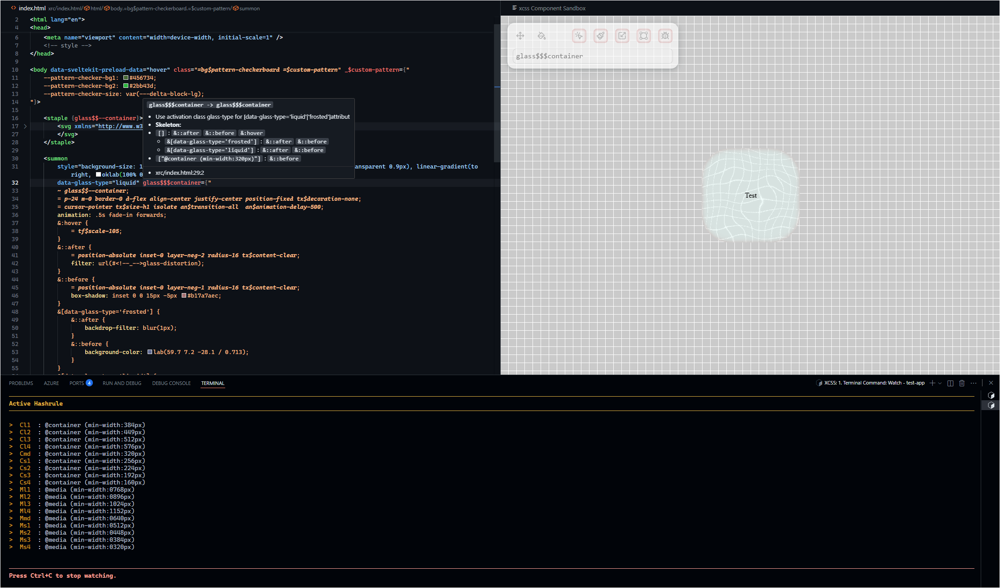

# XCSS Extension for VS Code

An extension that enhances development workflow with XCSS, with essential features.

## Commands
- **xcss.switch**: Switch between source and target files `Alt+Ctrl+X`.
- **xcss.format**: Format & toggle fold XCSS attributes `Alt+Shift+X`.

## Features

- **Activation switch**: Placed on on statusbar.

- **CSS Features**: Valid for `reference` & `target` stylesheets. 
  - XCSS-specific at-rules (`@--pre-bind`, `@--post-bind`, `@--compose`).
  - Intellisense suggustions following at-rules.

- **Target Folder Features**: 
  - Intellisense.
  - Hover information.
  - Provides folding ranges.
  - Colorpicker in value blocks.
  - Attribute Detection, Decoration and Hignlighting.
  - Color picker for `rgb`/`rgba`/`hsl`/`hsla`/`lch`/`oklch`/`lab`/`oklab`/`hex`.

- **Intellisense**.
  - CSS property, value and variable suggestions.
  - Xtyle suggustions for bindables and composables.
  - XCSS-specific at-rules and corresponding shortcuts.
  
## Requirements

- An xcss-initialized project with:
  - xtyles/configure.jsonc
  - xtyles/autogen/manifest.json (auto-generated)